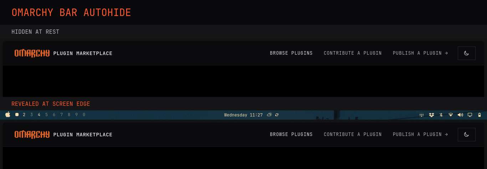

# Omarchy Bar Autohide

An event-driven auto-hide service plugin for the Omarchy bar.



> [!IMPORTANT]
> This plugin is for **Omarchy 4 (Quattro)**, where the desktop shell and bar
> use [Quickshell](https://quickshell.org/). It is not intended for older
> Omarchy releases that use Waybar.

## Behavior

- Supports bars anchored to the top, bottom, left, or right screen edge.
- Reveals the bar only when the pointer reaches its anchored screen edge.
- Keeps the bar open while the pointer remains over it.
- Hides the bar 1000ms after the pointer leaves that area.
- Leaves the bar visible when the user opens it with the bar hotkey.
- Keeps the bar visible while a bar popout is open.
- Supports multiple monitors, scaling, rotation, and monitor offsets.

A transparent one-pixel Quickshell surface listens for pointer entry at the bar
edge. A passive hover observer attached to each live bar surface handles pointer
exit without blocking its controls. There is no cursor polling and no persistent
helper process, so the plugin causes no idle timer wakeups.

## Requirements

- Omarchy with the Quickshell bar
- Hyprland

## Install

```bash
omarchy plugin add https://github.com/ericvrp/omarchy-bar-autohide.git --enable
```

Omarchy clones the repository to
`~/.config/omarchy/plugins/ericvrp.bar-autohide`, validates it, and enables the
service in the shell configuration.

## Update

```bash
omarchy plugin update ericvrp.bar-autohide
```

## Disable

```bash
omarchy plugin disable ericvrp.bar-autohide
```

Disabling or removing the plugin restores the bar visibility state from before
the plugin was enabled.

## Uninstall

```bash
omarchy plugin remove ericvrp.bar-autohide
```

## License And Warranty

Licensed under the [MIT License](LICENSE).

The software is provided **as is, without warranty of any kind**, express or
implied. See the license for the complete warranty and liability disclaimer.

Development and local testing instructions are in [DEVELOPING.md](DEVELOPING.md).
